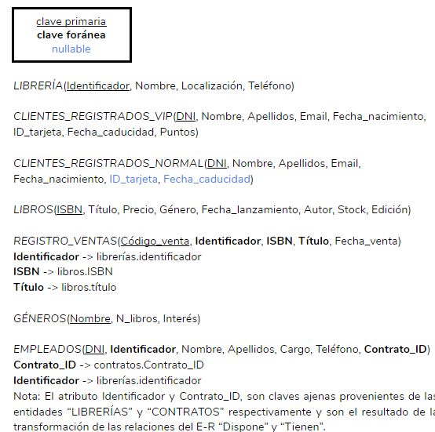
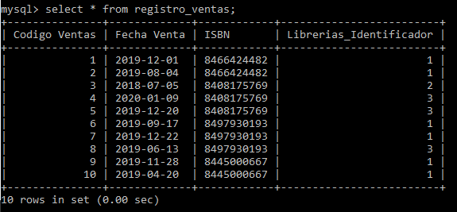

# PROYECTO FINAL DE ADMINISTRACIÓN Y DISEÑO DE BASES DE DATOS
## Proyecto de implementación de una base de datos para el supuesto de Librería Epopeya.

### Integrantes   

> Sergio Delgado López (alu0100893601@ull.edu.es)

> Eduardo Pérez Hernández (alu0100991659@ull.edu.es)

> Sergio Moreno Martín (alu0100710298@ull.edu.es)

## 1. Resumen ejecutivo.

A lo largo de este documento se ha recogido todos los pasos llevados a cabo para realizar un proyecto de base de datos sobre un supuesto que previamente se ha inventado con el fin de cumplir todos los requisitos establecidos para poder considerar que el proyecto realizado ha sido un éxito.

Entre estos procesos se puede destacar la definición de los requisitos del proyecto, donde se definen los requerimientos de forma explícita y extendida que  sirven para establecer las bases de todo lo que acontece en el proyecto. También figuran los modelos de la base de datos, es decir, los modelos de Entidad-Relación, UMLs, etc. A parte de esto se describen otros conceptos de manera más detallada para cumplimentar todo lo referente al proyecto.


## 2. Definición de requisitos del sistema de base de datos.

> Enlace al documento: [Documento de requisitos](https://github.com/alu0100893601-Sergio/ADBBDD19_20/blob/master/PROYECTO-FINAL/Documentos-finales/Requisitos%20de%20Libreria%20Epopeya.pdf) 

La empresa Epopeya se dedica a la venta de libros de toda índole, desde los manuscritos más clásicos hasta lo último en vanguardia. Es una empresa con una gran trayectoria dentro del sector, y en los últimos tiempos se ha decidido informatizarse, para así poder dar un mejor servicio a sus clientes, así como para llevar una gestión más eficientes de sus librerías y recursos.  

Siendo como es una gran empresa con un gran número de librerías en su flota es importante, en primer lugar, tener almacenadas las diferentes librerías de las que dispone la empresa debiendo quedar almacenadas el código identificativo de la librería así como su nombre, localización y teléfono.  

El capital humano es de suma importancia para esta empresa por lo que también se desea almacenar los empleados de los que dispone cada una de las librerías de la empresa debiendo recoger su DNI, nombre completo, datos de contacto y su cargo dentro de la librería.  

Del mismo modo, se desea almacenar la información relevante del contrato de cada trabajador, en el que se especifica un código identificativo del contrato, DNI y nombre completo del trabajador, su sueldo, el tipo de contrato pudiendo ser éste temporal o indefinido, debiendo indicarse la fecha de inicio del mismo y la de finalización en caso de que sea temporal.  
 
Por supuesto, el eje central de toda empresa de éste sector son los libros, y por lo tanto se debe almacenar, minuciosamente, toda la información correspondiente a los mismos, de cara a ofrecer el mejor servicio posible. Para ello será necesario recoger el código identificativo de cada libro, su código ISBN, su nombre completo, su edición, la categoría a la que pertenece (al menos una), su fecha de lanzamiento, su precio y su autor. También se desea saber el stock que hay de cada libro en cada librería.  

La empresa también desea llevar un registro de los libros vendidos en cada librería, para ello se debe recoger, el código de la venta, el nombre del libro su ISBN, y la fecha en la que fue vendido.  

Dado que la empresa tiene en su haber un gran cantidad de libros en su catálogo, es importante dividir a los mismos en categorías siguiendo el clásico modelo de temáticas (terror, fantasía, etc). Por lo tanto se desea también almacenar las diferentes categorías en las que se agrupan los libros, para ello se especificará el nombre de cada categoría, así como la cantidad de libros pertenecientes a la misma. Hay que tener en cuenta que un libro puede pertenecer a más de un género. Se quiere también el interés que hay en cada categoría, que se deberá calcular mediante las siguientes fórmulas matemáticas.  


Se sabe que para el público interesado en los libros es importante conocer las últimas novedades que han sido publicadas. Estos libros estarán en primera línea del escaparate de las tienda y la página web, y por tanto se deberá recoger el día en que se puso en novedades y la cantidad de tiempo que debe permanecer en la misma.  

Por último, la empresa quiere implementar un sistema de puntos para clientes VIP, donde distinguirlos de los clientes normales, en el cual premiar a aquellos clientes con una alta fidelización en la empresa. Para distinguir a los clientes normales de los VIP se va a usar una tarjeta de socio con la que poder realizar compras tanto online como en las tiendas, dichas tarjetas serán distintas para los usuarios estándar y los VIP. De manera genérica se desea almacenar de ambos tipos sus datos personales (DNI, Nombre completo, correo electrónico y fecha de nacimiento). Los usuarios VIP tendran una tarjeta VIP con su identificador, la fecha de caducidad y la cantidad de puntos acumulados), debe tenerse en cuenta que el cliente puede canjear y aumentar su puntos en cualquier librería perteneciente a la empresa.. Los clientes normales en cambio tendrán una tarjeta normal con un identificador y una fecha de caducidad igual a la VIP, pero en este caso no tendrán puntos, simplemente les servirá para identificarse como clientes.  

Partiendo de todas estas especificaciones se pide obtener un diagrama ER para la BBDD de Epopeya y posteriormente realizar una implementación, teniendo en cuenta todas las restricciones comentadas, y asegurando la coherencia de la información a gestionar.  

## 3. Realización de modelos.

### 3.1. Modelo Entidad-Relación.

Por definición, un modelo de entidad-relación es una herramienta para el modelo de datos, la cual permite representar entidades de una Base de Datos [[1](https://es.wikipedia.org/wiki/Modelo_entidad-relaci%C3%B3n)], siguiendo los siguientes pasos:  

* Se elabora el diagrama (o diagramas) entidad-relación.
* Se completa el modelo con listas de atributos y una descripción de otras restricciones que no se pueden reflejar en el diagrama.  

El nivel de complejidad de un diagrama ER puede variar mucho, por ello se ha decidido elaborar dos iteraciones de diagrama, donde en la primera se hará un primera aproximación a modo de toma de contacto, y luego se hará uno más complejo que será la versión final de éste.

### 3.1.1. Primera aproximación.

 

### 3.1.2. ER extendido (diseño de la BD).

> Enlace al documento: [Documento de ERE](https://github.com/alu0100893601-Sergio/ADBBDD19_20/blob/master/PROYECTO-FINAL/Documentos-finales/ER%20extendido.pdf)  

IDENTIFICAIÓN Y DEFINICIÓN DE ENTIDADES  

1. **Librerías**: Representa a cada una de las librerías de la cadena Epopeya.  

| Atributo      | Tipo        |
| :-----------: |:-----------:|
| **Identificador** | Varchar(10) |
| Localización  | Varchar(50) |
| Nombre        | Varchar(30) |
| Teléfono      | Varchar(12) |

2. **Libros**: Es la entidad que representa a cada uno de los libros de los que se dispone.  

|       Atributo       |      Tipo     |
|:--------------------:|:-------------:|
|         **ISBN**         |  Varchar(12)  |
|        Título        |  Varchar(50)  |
|        Precio        |     Float     |
|        Género        |  Varchar(20)  |
| Fecha de lanzamiento |      Date     |
|         Autor        | Varchar(100)  |
|         Stock        |      Int      |
|        Edición       |      Int      |

3. **Clientes registrados**: Representa a los clientes registrados a las librerías.  

|          Atributo          |     Tipo     |
|:--------------------------:|:------------:|
|             **DNI**            |  Varchar(9)  |
|       Nombre comlpeto      | Varchar(100) |
|           *Nombre          |  Varchar(30) |
|         *Apellidos         |  Varchar(30) |
|            Email           |  Varchar(30) |
|     Fecha de nacimiento    |     Date     |
|    Identificador tarjeta   |  Varchar(10) |
| Fecha de caducidad tarjeta |     Date     |

4. **_Clientes registrados_/VIP**: Distinción para los usuario de tipo VIP.  

|          Atributo          |     Tipo     |
|:--------------------------:|:------------:|
|             Puntos         |  Int         |

5. **_Clientes registrados_/Normal**: Distinción para los usuarios de tipo Normal.  

6. **Empleados**: Entidad para registrar a todos los empleados de la empresa.  

|          Atributo          |     Tipo     |
|:--------------------------:|:------------:|
|             **DNI**            |  Varchar(9)  |
|          Teléfono          |  Varchar(12) |
|            Cargo           |  Varchar(30) |
|       Nombre completo      | Varchar(100) |
|           *Nombre          |  Varchar(30) |
|         *Apellidos         |  Varchar(30) |

7. **Contratos**: Es la entidad asociada a los empleados para registrar sus contratos.  

|          Atributo          |     Tipo     |
|:--------------------------:|:------------:|
|        **Identificador**       |  Varchar(10) |
|            *DNI            |  Varchar(9)  |
|         *ContratoID        |  Varchar(10) |
|           Sueldo           |     Float    |
|       Nombre completo      | Varchar(100) |
|           *Nombre          |  Varchar(30) |
|         *Apellidos         |  Varchar(30) |
|       Fecha de inicio      |     Date     |

8. **_Contratos_/Indefinido**: Para los contratos indefinidos.  

9. **_Contratos_/Temporal**: Para los contratos temporales.  

|          Atributo          |     Tipo     |
|:--------------------------:|:------------:|
|  Fecha de finalización     |  Date        |

10. **Registro de ventas**: Para conocer los datos de una venta de libros en las librerías.  

|     Atributo    |     Tipo    |
|:---------------:|:-----------:|
| **Código de venta** | Varchar(10) |
|  Fecha de venta |     Date    |
|       ISBN      | Varchar(12) |
|      Título     | Varchar(50) |

11. **Géneros**: Sirve para distinguir los géneros en los que se puede encapsular un libro.  

|   Atributo   |     Tipo    |
|:------------:|:-----------:|
|    **Nombre**    | Varchar(20) |
| Nº de libros |     Int     |
|    Interés   | Varchar(10) |

IDENTIFICACIÓN Y DEFINICIÓN DE INTERRELACIONES  

- Las librerías (1,N) CUENTAN CON (0,N) clientes registrados.
- Las librerías (1,1) ALMACENAN (0,N) registro de ventas.
- Las librerías (1,1) DISPONEN (1,N) empleados.
- Las librerías (0,N) DISPONEN (0,N) libros. 

|   Atributo   |     Tipo     |
|:------------:|:------------:|
|  Stock       |  Int         |
|  Precio      |  Float       |

- Las librerías tienen libros NOVEDOSOS (exclusividad).

|   Atributo                     |     Tipo     |
|:------------------------------:|:------------:|
|  Fecha de inicio novedad       |  Date        |
|  Plazo en novedad              |  Time        |

- Los libros (0,N) PERTENECEN (1,N) géneros.
- Los empleados (1,1) TIENEN (débil) (1,1) contratos.

Al trasladar esto a la herramienta de MySQL Workbench para obtener una visión más detallada del modelo, se obtiene el siguiente resultado.

  

Una vez obtenido esto, dentro de esta herramienta se generarán los códigos necesarios para crear la base de datos, introducir registros, etc., tal y como se detalla en epígrafes posteriores.

### 3.2. Modelo Relacional.

 > Enlace al documento: [Documento de Modelo Relacional](https://github.com/alu0100893601-Sergio/ADBBDD19_20/blob/master/PROYECTO-FINAL/Documentos-finales/Modelo%20relacional.pdf) 

El modelo relacional se usa para el modelado y la gestión de bases de datos, es un modelo de datos basado en la lógica de predicados y en la teoría de conjuntos. Con esta idea, se ha procedido con el supuesto de este proyecto para obtener un modelo relacional que cumpla con los requisitos necesarios, tal y como se muestra a continuación.

  

  

### 3.3. Modelo UML.

> Enlace al documento: [Documento de modelo Objeto-Relacional](https://github.com/alu0100893601-Sergio/ADBBDD19_20/blob/master/PROYECTO-FINAL/Documentos-finales/Modelo%20ObjetoRelacional.pdf) 

Por definición, UML es un lenguaje de modelado visual común y semántica y sintácticamente rico para la arquitectura, el diseño y la implementación de sistemas de software complejos, tanto en estructura como en comportamiento. Por ello UML es efectivo para el modelado de alto nivel de datos conceptuales y se puede usar en diferentes tipos de diagramas UML.

De esta manera, para la base de datos que se pretende crear en este proyecto, con UML se obtiene lo siguiente.

  

### 3.3.1. Script

> Enlace al archivo: [Script con UML](https://github.com/alu0100893601-Sergio/ADBBDD19_20/blob/master/PROYECTO-FINAL/archivos-Scripts/script_from_UML.sql) 

```SQL  
--Librerias--
CREATE TABLE Librerias
(
    Identificador text PRIMARY KEY,
    Localizacion text NOT NULL,
    Nombre text NOT NULL,
    Telefono text NOT NULL
);

--Libros--
CREATE TABLE Libros
(
    ISBN text PRIMARY KEY,
    Titulo text NOT NULL,
    Precio INTEGER NOT NULL,
    Genero text NOT NULL,
    Fecha_lanzamiento TIMESTAMP NOT NULL,
    Autor text NOT NULL,
    Edicion INTEGER NOT NULL,
    Stock INTEGER NOT NULL
);

--Clientes registrados VIP--
CREATE TABLE Clientes_registrados_vip
(
    DNI text PRIMARY KEY,
    Nombre text NOT NULL,
    Apellidos text NOT NULL,
    Email text NOT NULL,
    Fecha_nacimiento TIMESTAMP NOT NULL,
    ID_tarjeta text NOT NULL,
    Fecha_caducidad TIMESTAMP NOT NULL,
    Puntos INTEGER NOT NULL
);

--Clientes registrados Normales--
CREATE TABLE Clientes_registrados_normales
(
    DNI text PRIMARY KEY,
    Nombre text NOT NULL,
    Apellidos text NOT NULL,
    Email text NOT NULL,
    Fecha_nacimiento TIMESTAMP NOT NULL,
    ID_tarjeta text,
    Fecha_caducidad TIMESTAMP
);

--Generos--
CREATE TABLE Generos
(
    Nombre text PRIMARY KEY,
    N_libros INTEGER NOT NULL,
    Interes text NOT NULL
);

--Registro de ventas--
CREATE TABLE Registro_ventas
(
    Codigo_venta text PRIMARY KEY,
    Fecha_venta TIMESTAMP NOT NULL,
);

--Empleados--
CREATE TABLE Empleados
(
    DNI text PRIMARY KEY,
    Telefono text NOT NULL,
    Cargo text NOT NULL, 
    Nombre text NOT NULL,
    Apellidos text NOT NULL
);

--Contratos temporales--
CREATE TABLE Contratos_temporales
(
    Contrato_ID text NOT NULL,
    Sueldo INTEGER NOT NULL,
    Nombre text NOT NULL,
    Apellidos text NOT NULL,
    Fecha_inicio TIMESTAMP NOT NULL,
    Fecha_fin TIMESTAMP NOT NULL
);

--Contratos indefinidos--
CREATE TABLE Contratos_indefinidos
(
    Contrato_ID text NOT NULL,
    Sueldo INTEGER NOT NULL,
    Nombre text NOT NULL,
    Apellidos text NOT NULL,
    Fecha_inicio TIMESTAMP NOT NULL
);
```

## 4. Códigos SQL generados.

> Enlace al documento: [Documento de Scripts](https://github.com/alu0100893601-Sergio/ADBBDD19_20/blob/master/PROYECTO-FINAL/Documentos-finales/Scripts.pdf) 

> Enlace al archivo: [Script de creacion de tablas](https://github.com/alu0100893601-Sergio/ADBBDD19_20/blob/master/PROYECTO-FINAL/archivos-Scripts/creacion_tablas.sql) 

```SQL
-- MySQL Workbench Forward Engineering

SET @OLD_UNIQUE_CHECKS=@@UNIQUE_CHECKS, UNIQUE_CHECKS=0;
SET @OLD_FOREIGN_KEY_CHECKS=@@FOREIGN_KEY_CHECKS, FOREIGN_KEY_CHECKS=0;
SET @OLD_SQL_MODE=@@SQL_MODE, SQL_MODE='ONLY_FULL_GROUP_BY,STRICT_TRANS_TABLES,NO_ZERO_IN_DATE,NO_ZERO_DATE,ERROR_FOR_DIVISION_BY_ZERO,NO_ENGINE_SUBSTITUTION';

-- -----------------------------------------------------
-- Schema Epopeyadb
-- -----------------------------------------------------

-- -----------------------------------------------------
-- Schema Epopeyadb
-- -----------------------------------------------------
CREATE SCHEMA IF NOT EXISTS `Epopeyadb` DEFAULT CHARACTER SET utf8 ;
USE `Epopeyadb` ;

-- -----------------------------------------------------
-- Table `Epopeyadb`.`Librerias`
-- -----------------------------------------------------
CREATE TABLE IF NOT EXISTS `Epopeyadb`.`Librerias` (
  `Identificador` INT NOT NULL,
  `Localizacion` VARCHAR(45) NOT NULL,
  `Telefono` VARCHAR(9) NOT NULL,
  `Nombre` VARCHAR(45) NOT NULL,
  PRIMARY KEY (`Identificador`))
ENGINE = InnoDB;


-- -----------------------------------------------------
-- Table `Epopeyadb`.`Empleados`
-- -----------------------------------------------------
CREATE TABLE IF NOT EXISTS `Epopeyadb`.`Empleados` (
  `DNI` VARCHAR(9) NOT NULL,
  `Nombre` VARCHAR(45) NOT NULL,
  `Apellidos` VARCHAR(45) NOT NULL,
  `Telefono` VARCHAR(9) NOT NULL,
  `Cargo` VARCHAR(45) NOT NULL,
  `Librerias_Identificador` INT NOT NULL,
  PRIMARY KEY (`DNI`, `Librerias_Identificador`),
  INDEX `fk_Empleados_Librerias_idx` (`Librerias_Identificador` ASC) VISIBLE,
  CONSTRAINT `fk_Empleados_Librerias`
    FOREIGN KEY (`Librerias_Identificador`)
    REFERENCES `Epopeyadb`.`Librerias` (`Identificador`)
    ON DELETE NO ACTION
    ON UPDATE CASCADE)
ENGINE = InnoDB;


-- -----------------------------------------------------
-- Table `Epopeyadb`.`Clientes_Registrados_VIP`
-- -----------------------------------------------------
CREATE TABLE IF NOT EXISTS `Epopeyadb`.`Clientes_Registrados_VIP` (
  `DNI` VARCHAR(9) NOT NULL,
  `Nombre` VARCHAR(45) NOT NULL,
  `Apellidos` VARCHAR(45) NOT NULL,
  `Email` VARCHAR(45) NOT NULL,
  `Fecha nacimiento` DATE NOT NULL,
  `ID_Tarjeta` INT NOT NULL,
  `Fecha Caducidad` DATE NOT NULL,
  `Puntos` INT NOT NULL,
  PRIMARY KEY (`DNI`))
ENGINE = InnoDB;


-- -----------------------------------------------------
-- Table `Epopeyadb`.`Clientes_Registrados_Normal`
-- -----------------------------------------------------
CREATE TABLE IF NOT EXISTS `Epopeyadb`.`Clientes_Registrados_Normal` (
  `DNI` VARCHAR(9) NOT NULL,
  `Nombre` VARCHAR(45) NOT NULL,
  `Apellidos` VARCHAR(45) NOT NULL,
  `Email` VARCHAR(45) NOT NULL,
  `Fecha nacimiento` DATE NOT NULL,
  `ID_Tarjeta` INT NULL,
  `Fecha caducidad` DATE NULL,
  PRIMARY KEY (`DNI`))
ENGINE = InnoDB;


-- -----------------------------------------------------
-- Table `Epopeyadb`.`Cuentan_con`
-- -----------------------------------------------------
CREATE TABLE IF NOT EXISTS `Epopeyadb`.`Cuentan_con` (
  `Librerias_Identificador` INT NOT NULL,
  `Clientes Registrados VIP_DNI` VARCHAR(9) NOT NULL,
  `Clientes Registrados Normal_DNI` VARCHAR(9) NOT NULL,
  INDEX `fk_Librerias_has_Clientes Registrados_Librerias1_idx` (`Librerias_Identificador` ASC) VISIBLE,
  INDEX `fk_Cuentan con_Clientes Registrados VIP1_idx` (`Clientes Registrados VIP_DNI` ASC) VISIBLE,
  INDEX `fk_Cuentan con_Clientes Registrados Normal1_idx` (`Clientes Registrados Normal_DNI` ASC) VISIBLE,
  PRIMARY KEY (`Librerias_Identificador`, `Clientes Registrados VIP_DNI`, `Clientes Registrados Normal_DNI`),
  CONSTRAINT `fk_Librerias_has_Clientes Registrados_Librerias1`
    FOREIGN KEY (`Librerias_Identificador`)
    REFERENCES `Epopeyadb`.`Librerias` (`Identificador`)
    ON DELETE CASCADE
    ON UPDATE CASCADE,
  CONSTRAINT `fk_Cuentan con_Clientes Registrados VIP1`
    FOREIGN KEY (`Clientes Registrados VIP_DNI`)
    REFERENCES `Epopeyadb`.`Clientes_Registrados_VIP` (`DNI`)
    ON DELETE CASCADE
    ON UPDATE CASCADE,
  CONSTRAINT `fk_Cuentan con_Clientes Registrados Normal1`
    FOREIGN KEY (`Clientes Registrados Normal_DNI`)
    REFERENCES `Epopeyadb`.`Clientes_Registrados_Normal` (`DNI`)
    ON DELETE CASCADE
    ON UPDATE CASCADE)
ENGINE = InnoDB;


-- -----------------------------------------------------
-- Table `Epopeyadb`.`Libros`
-- -----------------------------------------------------
CREATE TABLE IF NOT EXISTS `Epopeyadb`.`Libros` (
  `ISBN` VARCHAR(20) NOT NULL,
  `Titulo` VARCHAR(45) NOT NULL,
  `Precio` DOUBLE NOT NULL,
  `Fecha lanzamiento` DATE NOT NULL,
  `Autor` VARCHAR(45) NOT NULL,
  `Stock` INT NOT NULL,
  `Edicion` INT NOT NULL,
  PRIMARY KEY (`ISBN`))
ENGINE = InnoDB;


-- -----------------------------------------------------
-- Table `Epopeyadb`.`Registro_Ventas`
-- -----------------------------------------------------
CREATE TABLE IF NOT EXISTS `Epopeyadb`.`Registro_Ventas` (
  `Codigo Ventas` INT NOT NULL,
  `Fecha Venta` DATE NOT NULL,
  `ISBN` VARCHAR(20) NOT NULL,
  `Librerias_Identificador` INT NOT NULL,
  PRIMARY KEY (`Codigo Ventas`, `ISBN`, `Librerias_Identificador`),
  INDEX `fk_Registro Ventas_Librerias1_idx` (`Librerias_Identificador` ASC) VISIBLE,
  INDEX `fk_Registro Ventas_Libros_idx` (`ISBN` ASC) VISIBLE,
  CONSTRAINT `fk_Registro Ventas_Librerias1`
    FOREIGN KEY (`Librerias_Identificador`)
    REFERENCES `Epopeyadb`.`Librerias` (`Identificador`)
    ON DELETE NO ACTION
    ON UPDATE CASCADE,
  CONSTRAINT `fk_Registro Ventas_Libros1`
    FOREIGN KEY (`ISBN`)
    REFERENCES `Epopeyadb`.`Libros` (`ISBN`)
    ON DELETE NO ACTION
    ON UPDATE CASCADE)
ENGINE = InnoDB;


-- -----------------------------------------------------
-- Table `Epopeyadb`.`Contrato_Indefinido`
-- -----------------------------------------------------
CREATE TABLE IF NOT EXISTS `Epopeyadb`.`Contrato_Indefinido` (
  `Contrato_ID` VARCHAR(20) NOT NULL,
  `Empleados_DNI` VARCHAR(9) NOT NULL,
  `Nombre` VARCHAR(45) NOT NULL,
  `Apellidos` VARCHAR(45) NOT NULL,
  `Sueldo` INT NOT NULL,
  `Fecha_inicio` DATE NOT NULL,
  PRIMARY KEY (`Contrato_ID`, `Empleados_DNI`),
  INDEX `fk_Contrato Indefinido_Empleados1_idx` (`Empleados_DNI` ASC) VISIBLE,
  CONSTRAINT `fk_Contrato Indefinido_Empleados1`
    FOREIGN KEY (`Empleados_DNI`)
    REFERENCES `Epopeyadb`.`Empleados` (`DNI`)
    ON DELETE NO ACTION
    ON UPDATE CASCADE)
ENGINE = InnoDB;


-- -----------------------------------------------------
-- Table `Epopeyadb`.`Contrato_Temporal`
-- -----------------------------------------------------
CREATE TABLE IF NOT EXISTS `Epopeyadb`.`Contrato_Temporal` (
  `Contrato_ID` VARCHAR(20) NOT NULL,
  `Empleados_DNI` VARCHAR(9) NOT NULL,
  `Nombre` VARCHAR(45) NOT NULL,
  `Apellidos` VARCHAR(45) NOT NULL,
  `Sueldo` INT NOT NULL,
  `Fecha_inicio` DATE NOT NULL,
  `Fecha_finalizacion` DATE NOT NULL,
  PRIMARY KEY (`Contrato_ID`, `Empleados_DNI`),
  INDEX `fk_Contrato_id_Empleados1_idx` (`Empleados_DNI` ASC) VISIBLE,
  CONSTRAINT `fk_Contrato_id_Empleados1`
    FOREIGN KEY (`Empleados_DNI`)
    REFERENCES `Epopeyadb`.`Empleados` (`DNI`)
    ON DELETE NO ACTION
    ON UPDATE CASCADE)
ENGINE = InnoDB;


-- -----------------------------------------------------
-- Table `Epopeyadb`.`Generos`
-- -----------------------------------------------------
CREATE TABLE IF NOT EXISTS `Epopeyadb`.`Generos` (
  `Nombre` VARCHAR(45) NOT NULL,
  `Numero libros` INT NOT NULL,
  `Interés` VARCHAR(45) NOT NULL,
  PRIMARY KEY (`Nombre`))
ENGINE = InnoDB;


-- -----------------------------------------------------
-- Table `Epopeyadb`.`Pertenece`
-- -----------------------------------------------------
CREATE TABLE IF NOT EXISTS `Epopeyadb`.`Pertenece` (
  `Libros_ISBN` VARCHAR(20) NOT NULL,
  `Generos_Nombre` VARCHAR(45) NOT NULL,
  PRIMARY KEY (`Generos_Nombre`, `Libros_ISBN`),
  INDEX `fk_Pertenece_Libros1_idx` (`Libros_ISBN` ASC) VISIBLE,
  INDEX `fk_Pertenece_Generos1_idx` (`Generos_Nombre` ASC) VISIBLE,
  CONSTRAINT `fk_Pertenece_Libros1`
    FOREIGN KEY (`Libros_ISBN`)
    REFERENCES `Epopeyadb`.`Libros` (`ISBN`)
    ON DELETE CASCADE
    ON UPDATE CASCADE,
  CONSTRAINT `fk_Pertenece_Generos1`
    FOREIGN KEY (`Generos_Nombre`)
    REFERENCES `Epopeyadb`.`Generos` (`Nombre`)
    ON DELETE NO ACTION
    ON UPDATE NO ACTION)
ENGINE = InnoDB;


-- -----------------------------------------------------
-- Table `Epopeyadb`.`Dispone`
-- -----------------------------------------------------
CREATE TABLE IF NOT EXISTS `Epopeyadb`.`Dispone` (
  `Librerias_Identificador` INT NOT NULL,
  `Libros_ISBN` VARCHAR(20) NOT NULL,
  `Stock` INT NOT NULL,
  `Precio` INT NOT NULL,
  INDEX `fk_Dispone_Librerias1_idx` (`Librerias_Identificador` ASC) VISIBLE,
  INDEX `fk_Dispone_Libros1_idx` (`Libros_ISBN` ASC) VISIBLE,
  PRIMARY KEY (`Librerias_Identificador`, `Libros_ISBN`),
  CONSTRAINT `fk_Dispone_Librerias1`
    FOREIGN KEY (`Librerias_Identificador`)
    REFERENCES `Epopeyadb`.`Librerias` (`Identificador`)
    ON DELETE CASCADE
    ON UPDATE CASCADE,
  CONSTRAINT `fk_Dispone_Libros1`
    FOREIGN KEY (`Libros_ISBN`)
    REFERENCES `Epopeyadb`.`Libros` (`ISBN`)
    ON DELETE NO ACTION
    ON UPDATE NO ACTION)
ENGINE = InnoDB;


-- -----------------------------------------------------
-- Table `Epopeyadb`.`Novedoso`
-- -----------------------------------------------------
CREATE TABLE IF NOT EXISTS `Epopeyadb`.`Novedoso` (
  `Librerias_Identificador` INT NOT NULL,
  `Libros_ISBN` VARCHAR(20) NOT NULL,
  `Fecha_inicio` DATE NOT NULL,
  `Fecha_fin` DATE NOT NULL,
  INDEX `fk_Novedoso_Librerias1_idx` (`Librerias_Identificador` ASC) VISIBLE,
  INDEX `fk_Novedoso_Libros1_idx` (`Libros_ISBN` ASC) VISIBLE,
  PRIMARY KEY (`Librerias_Identificador`, `Libros_ISBN`),
  CONSTRAINT `fk_Novedoso_Librerias1`
    FOREIGN KEY (`Librerias_Identificador`)
    REFERENCES `Epopeyadb`.`Librerias` (`Identificador`)
    ON DELETE CASCADE
    ON UPDATE CASCADE,
  CONSTRAINT `fk_Novedoso_Libros1`
    FOREIGN KEY (`Libros_ISBN`)
    REFERENCES `Epopeyadb`.`Libros` (`ISBN`)
    ON DELETE CASCADE
    ON UPDATE CASCADE)
ENGINE = InnoDB;


SET SQL_MODE=@OLD_SQL_MODE;
SET FOREIGN_KEY_CHECKS=@OLD_FOREIGN_KEY_CHECKS;
SET UNIQUE_CHECKS=@OLD_UNIQUE_CHECKS;
```

> Enlace al archivo: [Script de carga de datos](https://github.com/alu0100893601-Sergio/ADBBDD19_20/blob/master/PROYECTO-FINAL/archivos-Scripts/carga_datos.sql) 

```SQL
-- -----------------------------------------------------
-- Data for table `Epopeyadb`.`Librerias`
-- -----------------------------------------------------
START TRANSACTION;
USE `Epopeyadb`;
INSERT INTO `Epopeyadb`.`Librerias` (`Identificador`, `Localizacion`, `Telefono`, `Nombre`) VALUES (1, 'Calle Menta', '922834731', 'Epopeya 1');
INSERT INTO `Epopeyadb`.`Librerias` (`Identificador`, `Localizacion`, `Telefono`, `Nombre`) VALUES (2, 'Calle Poleo', '922738264', 'Epopeya 2');
INSERT INTO `Epopeyadb`.`Librerias` (`Identificador`, `Localizacion`, `Telefono`, `Nombre`) VALUES (3, 'Calle Sigma', '922837491', 'Epopeya S');

COMMIT;


-- -----------------------------------------------------
-- Data for table `Epopeyadb`.`Empleados`
-- -----------------------------------------------------
START TRANSACTION;
USE `Epopeyadb`;
INSERT INTO `Epopeyadb`.`Empleados` (`DNI`, `Nombre`, `Apellidos`, `Telefono`, `Cargo`, `Librerias_Identificador`) VALUES ('38291029R', 'Sergio', 'Chic Reus', '663289283', 'Encargado', 1);
INSERT INTO `Epopeyadb`.`Empleados` (`DNI`, `Nombre`, `Apellidos`, `Telefono`, `Cargo`, `Librerias_Identificador`) VALUES ('74837219D', 'María', 'Tosa Martin', '647381924', 'Dependienta', 1);
INSERT INTO `Epopeyadb`.`Empleados` (`DNI`, `Nombre`, `Apellidos`, `Telefono`, `Cargo`, `Librerias_Identificador`) VALUES ('89583294G', 'Jesús', 'Santana Santana', '634731234', 'Dependiente', 1);
INSERT INTO `Epopeyadb`.`Empleados` (`DNI`, `Nombre`, `Apellidos`, `Telefono`, `Cargo`, `Librerias_Identificador`) VALUES ('63473234H', 'Francisca', 'Rodríguez Pérez', '634332482', 'Encargada', 2);
INSERT INTO `Epopeyadb`.`Empleados` (`DNI`, `Nombre`, `Apellidos`, `Telefono`, `Cargo`, `Librerias_Identificador`) VALUES ('89343345V', 'Roberto ', 'Leal Leal', '634329851', 'Dependiente', 2);
INSERT INTO `Epopeyadb`.`Empleados` (`DNI`, `Nombre`, `Apellidos`, `Telefono`, `Cargo`, `Librerias_Identificador`) VALUES ('32484583J', 'Zaida', 'Tao Moreno', '612398453', 'Encargada', 3);
INSERT INTO `Epopeyadb`.`Empleados` (`DNI`, `Nombre`, `Apellidos`, `Telefono`, `Cargo`, `Librerias_Identificador`) VALUES ('84598453T', 'Natalia', 'Pérez Rodriguez', '632583257', 'Encargada', 3);
INSERT INTO `Epopeyadb`.`Empleados` (`DNI`, `Nombre`, `Apellidos`, `Telefono`, `Cargo`, `Librerias_Identificador`) VALUES ('87234984L', 'Dámaris', 'Moreno Delgado', '673249938', 'Dependienta', 3);
INSERT INTO `Epopeyadb`.`Empleados` (`DNI`, `Nombre`, `Apellidos`, `Telefono`, `Cargo`, `Librerias_Identificador`) VALUES ('32948465Y', 'Alberto', 'Creus Toledo', '684509023', 'Dependiente', 3);

COMMIT;


-- -----------------------------------------------------
-- Data for table `Epopeyadb`.`Clientes_Registrados_VIP`
-- -----------------------------------------------------
START TRANSACTION;
USE `Epopeyadb`;
INSERT INTO `Epopeyadb`.`Clientes_Registrados_VIP` (`DNI`, `Nombre`, `Apellidos`, `Email`, `Fecha nacimiento`, `ID_Tarjeta`, `Fecha Caducidad`, `Puntos`) VALUES ('97234733F', 'Mariano', 'Manuel Galea', 'marianomanuelgalea@gmail.com', '1995-12-22', 1, '2020-03-03', 1500);
INSERT INTO `Epopeyadb`.`Clientes_Registrados_VIP` (`DNI`, `Nombre`, `Apellidos`, `Email`, `Fecha nacimiento`, `ID_Tarjeta`, `Fecha Caducidad`, `Puntos`) VALUES ('87248126Y', 'Yohanna ', 'Masana', 'yohanna@hotmail.com', '1989-07-08', 2, '2020-10-09', 2000);
INSERT INTO `Epopeyadb`.`Clientes_Registrados_VIP` (`DNI`, `Nombre`, `Apellidos`, `Email`, `Fecha nacimiento`, `ID_Tarjeta`, `Fecha Caducidad`, `Puntos`) VALUES ('87234875T', 'Francisca ', 'Asis Chavarri', 'franciscaasischavarri@gmail.com', '1970-05-05', 3, '2021-06-03', 4000);
INSERT INTO `Epopeyadb`.`Clientes_Registrados_VIP` (`DNI`, `Nombre`, `Apellidos`, `Email`, `Fecha nacimiento`, `ID_Tarjeta`, `Fecha Caducidad`, `Puntos`) VALUES ('98458453V', 'Claudia', 'Cristina Pacon', 'claudiacristinapacon@gmail.com', '1983-12-10', 4, '2022-12-07', 500);

COMMIT;


-- -----------------------------------------------------
-- Data for table `Epopeyadb`.`Clientes_Registrados_Normal`
-- -----------------------------------------------------
START TRANSACTION;
USE `Epopeyadb`;
INSERT INTO `Epopeyadb`.`Clientes_Registrados_Normal` (`DNI`, `Nombre`, `Apellidos`, `Email`, `Fecha nacimiento`, `ID_Tarjeta`, `Fecha caducidad`) VALUES ('87234531U', 'Isabel', 'Rodriguez Wan', 'isabelrodri@gmail.com', '1996-03-20', NULL, NULL);
INSERT INTO `Epopeyadb`.`Clientes_Registrados_Normal` (`DNI`, `Nombre`, `Apellidos`, `Email`, `Fecha nacimiento`, `ID_Tarjeta`, `Fecha caducidad`) VALUES ('98457332V', 'Federico', 'Tomás Pérez', 'fede@gmail.com', '31-12-1990', 1, '2022-12-31');
INSERT INTO `Epopeyadb`.`Clientes_Registrados_Normal` (`DNI`, `Nombre`, `Apellidos`, `Email`, `Fecha nacimiento`, `ID_Tarjeta`, `Fecha caducidad`) VALUES ('87234775S', 'Fermin', 'Cabrera Cabrera', 'fermincabreracabrera@gmail.com', '1979-07-07', NULL, NULL);
INSERT INTO `Epopeyadb`.`Clientes_Registrados_Normal` (`DNI`, `Nombre`, `Apellidos`, `Email`, `Fecha nacimiento`, `ID_Tarjeta`, `Fecha caducidad`) VALUES ('98623675X', 'Marta', 'Reyes Reyes', 'martareyes@gmail.com', '1999-11-28', 2, '2020-12-31');

COMMIT;


-- -----------------------------------------------------
-- Data for table `Epopeyadb`.`Cuentan_con`
-- -----------------------------------------------------
START TRANSACTION;
USE `Epopeyadb`;
INSERT INTO `Epopeyadb`.`Cuentan_con` (`Librerias_Identificador`, `Clientes Registrados VIP_DNI`, `Clientes Registrados Normal_DNI`) VALUES (1, '97234733F', '87234531U');
INSERT INTO `Epopeyadb`.`Cuentan_con` (`Librerias_Identificador`, `Clientes Registrados VIP_DNI`, `Clientes Registrados Normal_DNI`) VALUES (2, '87248126Y', '98457332V');
INSERT INTO `Epopeyadb`.`Cuentan_con` (`Librerias_Identificador`, `Clientes Registrados VIP_DNI`, `Clientes Registrados Normal_DNI`) VALUES (3, '87234875T', '87234775S');
INSERT INTO `Epopeyadb`.`Cuentan_con` (`Librerias_Identificador`, `Clientes Registrados VIP_DNI`, `Clientes Registrados Normal_DNI`) VALUES (1, '98458453V', '98623675X');

COMMIT;


-- -----------------------------------------------------
-- Data for table `Epopeyadb`.`Libros`
-- -----------------------------------------------------
START TRANSACTION;
USE `Epopeyadb`;
INSERT INTO `Epopeyadb`.`Libros` (`ISBN`, `Titulo`, `Precio`, `Fecha lanzamiento`, `Autor`, `Stock`, `Edicion`) VALUES ('8466424482', 'Origen', 12.30, '2016-10-01', 'Dan Brown', 150, 2);
INSERT INTO `Epopeyadb`.`Libros` (`ISBN`, `Titulo`, `Precio`, `Fecha lanzamiento`, `Autor`, `Stock`, `Edicion`) VALUES ('8408176102', 'Fortaleza Digital', 10.30, '2000-10-01', 'Dan Brown', 150, 3);
INSERT INTO `Epopeyadb`.`Libros` (`ISBN`, `Titulo`, `Precio`, `Fecha lanzamiento`, `Autor`, `Stock`, `Edicion`) VALUES ('8408175769', 'La Conspiracion', 10.30, '2003-10-01', 'Dan Brown', 150, 3);
INSERT INTO `Epopeyadb`.`Libros` (`ISBN`, `Titulo`, `Precio`, `Fecha lanzamiento`, `Autor`, `Stock`, `Edicion`) VALUES ('8408175726', 'El Codigo Da Vinci', 10.30, '2006-10-01', 'Dan Brown', 150, 3);
INSERT INTO `Epopeyadb`.`Libros` (`ISBN`, `Titulo`, `Precio`, `Fecha lanzamiento`, `Autor`, `Stock`, `Edicion`) VALUES ('8408178946', 'El Fuego Invisible', 16.50, '2017-10-01', 'Javier Sierra', 150, 2);
INSERT INTO `Epopeyadb`.`Libros` (`ISBN`, `Titulo`, `Precio`, `Fecha lanzamiento`, `Autor`, `Stock`, `Edicion`) VALUES ('8497930193', 'Los ojos del Dragon', 9.99, '1996-10-01', 'Stephen King', 150, 6);
INSERT INTO `Epopeyadb`.`Libros` (`ISBN`, `Titulo`, `Precio`, `Fecha lanzamiento`, `Autor`, `Stock`, `Edicion`) VALUES ('8445000667', 'La Comunidad del Anillo', 16.20, '1957-10-01', 'Tolkien', 150, 9);

COMMIT;


-- -----------------------------------------------------
-- Data for table `Epopeyadb`.`Registro_Ventas`
-- -----------------------------------------------------
START TRANSACTION;
USE `Epopeyadb`;
INSERT INTO `Epopeyadb`.`Registro_Ventas` (`Codigo Ventas`, `Fecha Venta`, `ISBN`, `Librerias_Identificador`) VALUES (1, '2019-12-01', '8466424482', 1);
INSERT INTO `Epopeyadb`.`Registro_Ventas` (`Codigo Ventas`, `Fecha Venta`, `ISBN`, `Librerias_Identificador`) VALUES (2, '2019-08-04', '8466424482', 1);
INSERT INTO `Epopeyadb`.`Registro_Ventas` (`Codigo Ventas`, `Fecha Venta`, `ISBN`, `Librerias_Identificador`) VALUES (3, '2018-07-05', '8408175769', 2);
INSERT INTO `Epopeyadb`.`Registro_Ventas` (`Codigo Ventas`, `Fecha Venta`, `ISBN`, `Librerias_Identificador`) VALUES (4, '2020-01-09', '8408175769', 3);
INSERT INTO `Epopeyadb`.`Registro_Ventas` (`Codigo Ventas`, `Fecha Venta`, `ISBN`, `Librerias_Identificador`) VALUES (5, '2019-12-20', '8408175769', 3);
INSERT INTO `Epopeyadb`.`Registro_Ventas` (`Codigo Ventas`, `Fecha Venta`, `ISBN`, `Librerias_Identificador`) VALUES (6, '2019-09-17', '8497930193', 1);
INSERT INTO `Epopeyadb`.`Registro_Ventas` (`Codigo Ventas`, `Fecha Venta`, `ISBN`, `Librerias_Identificador`) VALUES (7, '2019-12-22', '8497930193', 1);
INSERT INTO `Epopeyadb`.`Registro_Ventas` (`Codigo Ventas`, `Fecha Venta`, `ISBN`, `Librerias_Identificador`) VALUES (8, '2019-06-13', '8497930193', 3);
INSERT INTO `Epopeyadb`.`Registro_Ventas` (`Codigo Ventas`, `Fecha Venta`, `ISBN`, `Librerias_Identificador`) VALUES (9, '2019-11-28', '8445000667', 1);
INSERT INTO `Epopeyadb`.`Registro_Ventas` (`Codigo Ventas`, `Fecha Venta`, `ISBN`, `Librerias_Identificador`) VALUES (10, '2019-04-20', '8445000667', 1);

COMMIT;


-- -----------------------------------------------------
-- Data for table `Epopeyadb`.`Contrato_Indefinido`
-- -----------------------------------------------------
START TRANSACTION;
USE `Epopeyadb`;
INSERT INTO `Epopeyadb`.`Contrato_Indefinido` (`Contrato_ID`, `Empleados_DNI`, `Nombre`, `Apellidos`, `Sueldo`, `Fecha_inicio`) VALUES ('1', '38291029R', 'Sergio', 'Chic Reus', 1400, '2018-08-20');
INSERT INTO `Epopeyadb`.`Contrato_Indefinido` (`Contrato_ID`, `Empleados_DNI`, `Nombre`, `Apellidos`, `Sueldo`, `Fecha_inicio`) VALUES ('2', '63473234H', 'Francisca', 'Rodríguez Pérez', 1400, '2018-05-04');
INSERT INTO `Epopeyadb`.`Contrato_Indefinido` (`Contrato_ID`, `Empleados_DNI`, `Nombre`, `Apellidos`, `Sueldo`, `Fecha_inicio`) VALUES ('3', '32484583J', 'Zaida', 'Tao Moreno', 1300, '2019-01-01');
INSERT INTO `Epopeyadb`.`Contrato_Indefinido` (`Contrato_ID`, `Empleados_DNI`, `Nombre`, `Apellidos`, `Sueldo`, `Fecha_inicio`) VALUES ('4', '84598453T', 'Natalia', 'Pérez Rodriguez', 1500, '2018-01-01');
INSERT INTO `Epopeyadb`.`Contrato_Indefinido` (`Contrato_ID`, `Empleados_DNI`, `Nombre`, `Apellidos`, `Sueldo`, `Fecha_inicio`) VALUES ('5', '74837219D', 'María', 'Tosa Martin', 1000, '2018-10-20');
INSERT INTO `Epopeyadb`.`Contrato_Indefinido` (`Contrato_ID`, `Empleados_DNI`, `Nombre`, `Apellidos`, `Sueldo`, `Fecha_inicio`) VALUES ('6', '87234984L', 'Dámaris', 'Moreno Delgado', 1000, '2018-09-06');

COMMIT;


-- -----------------------------------------------------
-- Data for table `Epopeyadb`.`Contrato_Temporal`
-- -----------------------------------------------------
START TRANSACTION;
USE `Epopeyadb`;
INSERT INTO `Epopeyadb`.`Contrato_Temporal` (`Contrato_ID`, `Empleados_DNI`, `Nombre`, `Apellidos`, `Sueldo`, `Fecha_inicio`, `Fecha_finalizacion`) VALUES ('1', '89583294G', 'Jesús', 'Santana Santana', 1000, '2019-09-03', '2020-09-03');
INSERT INTO `Epopeyadb`.`Contrato_Temporal` (`Contrato_ID`, `Empleados_DNI`, `Nombre`, `Apellidos`, `Sueldo`, `Fecha_inicio`, `Fecha_finalizacion`) VALUES ('2', '89343345V', 'Roberto ', 'Leal Leal', 1000, '2019-07-23', '2020-07-23');
INSERT INTO `Epopeyadb`.`Contrato_Temporal` (`Contrato_ID`, `Empleados_DNI`, `Nombre`, `Apellidos`, `Sueldo`, `Fecha_inicio`, `Fecha_finalizacion`) VALUES ('3', '32948465Y', 'Alberto', 'Creus Toledo', 1000, '2019-06-15', '2020-06-15');

COMMIT;


-- -----------------------------------------------------
-- Data for table `Epopeyadb`.`Generos`
-- -----------------------------------------------------
START TRANSACTION;
USE `Epopeyadb`;
INSERT INTO `Epopeyadb`.`Generos` (`Nombre`, `Numero libros`, `Interés`) VALUES ('Policiaca', 1500, 'Muy alto');
INSERT INTO `Epopeyadb`.`Generos` (`Nombre`, `Numero libros`, `Interés`) VALUES ('Fantastica', 2000, 'Alto');
INSERT INTO `Epopeyadb`.`Generos` (`Nombre`, `Numero libros`, `Interés`) VALUES ('Historica', 1235, 'Estandar');

COMMIT;


-- -----------------------------------------------------
-- Data for table `Epopeyadb`.`Pertenece`
-- -----------------------------------------------------
START TRANSACTION;
USE `Epopeyadb`;
INSERT INTO `Epopeyadb`.`Pertenece` (`Libros_ISBN`, `Generos_Nombre`) VALUES ('8466424482', 'Policiaca');
INSERT INTO `Epopeyadb`.`Pertenece` (`Libros_ISBN`, `Generos_Nombre`) VALUES ('8408176102', 'Policiaca');
INSERT INTO `Epopeyadb`.`Pertenece` (`Libros_ISBN`, `Generos_Nombre`) VALUES ('8408175769', 'Policiaca');
INSERT INTO `Epopeyadb`.`Pertenece` (`Libros_ISBN`, `Generos_Nombre`) VALUES ('8408175726', 'Policiaca');
INSERT INTO `Epopeyadb`.`Pertenece` (`Libros_ISBN`, `Generos_Nombre`) VALUES ('8408178946', 'Historica');
INSERT INTO `Epopeyadb`.`Pertenece` (`Libros_ISBN`, `Generos_Nombre`) VALUES ('8497930193', 'Fantastica');
INSERT INTO `Epopeyadb`.`Pertenece` (`Libros_ISBN`, `Generos_Nombre`) VALUES ('8445000667', 'Fantastica');

COMMIT;


-- -----------------------------------------------------
-- Data for table `Epopeyadb`.`Dispone`
-- -----------------------------------------------------
START TRANSACTION;
USE `Epopeyadb`;
INSERT INTO `Epopeyadb`.`Dispone` (`Librerias_Identificador`, `Libros_ISBN`, `Stock`, `Precio`) VALUES (1, '8466424482', 50, 12.30);
INSERT INTO `Epopeyadb`.`Dispone` (`Librerias_Identificador`, `Libros_ISBN`, `Stock`, `Precio`) VALUES (2, '8466424482', 50, 12.30);
INSERT INTO `Epopeyadb`.`Dispone` (`Librerias_Identificador`, `Libros_ISBN`, `Stock`, `Precio`) VALUES (3, '8466424482', 50, 12.30);
INSERT INTO `Epopeyadb`.`Dispone` (`Librerias_Identificador`, `Libros_ISBN`, `Stock`, `Precio`) VALUES (1, '8408176102', 90, 10.30);
INSERT INTO `Epopeyadb`.`Dispone` (`Librerias_Identificador`, `Libros_ISBN`, `Stock`, `Precio`) VALUES (2, '8408176102', 10, 10.30);
INSERT INTO `Epopeyadb`.`Dispone` (`Librerias_Identificador`, `Libros_ISBN`, `Stock`, `Precio`) VALUES (3, '8408176102', 50, 10.30);
INSERT INTO `Epopeyadb`.`Dispone` (`Librerias_Identificador`, `Libros_ISBN`, `Stock`, `Precio`) VALUES (1, '8408175769', 20, 10.30);
INSERT INTO `Epopeyadb`.`Dispone` (`Librerias_Identificador`, `Libros_ISBN`, `Stock`, `Precio`) VALUES (2, '8408175769', 20, 10.30);
INSERT INTO `Epopeyadb`.`Dispone` (`Librerias_Identificador`, `Libros_ISBN`, `Stock`, `Precio`) VALUES (3, '8408175769', 90, 10.30);
INSERT INTO `Epopeyadb`.`Dispone` (`Librerias_Identificador`, `Libros_ISBN`, `Stock`, `Precio`) VALUES (1, '8408175726', 100, 10.30);
INSERT INTO `Epopeyadb`.`Dispone` (`Librerias_Identificador`, `Libros_ISBN`, `Stock`, `Precio`) VALUES (2, '8408175726', 45, 10.30);
INSERT INTO `Epopeyadb`.`Dispone` (`Librerias_Identificador`, `Libros_ISBN`, `Stock`, `Precio`) VALUES (3, '8408175726', 5, 10.30);
INSERT INTO `Epopeyadb`.`Dispone` (`Librerias_Identificador`, `Libros_ISBN`, `Stock`, `Precio`) VALUES (1, '8408178946', 120, 16.50);
INSERT INTO `Epopeyadb`.`Dispone` (`Librerias_Identificador`, `Libros_ISBN`, `Stock`, `Precio`) VALUES (2, '8408178946', 30, 16.50);
INSERT INTO `Epopeyadb`.`Dispone` (`Librerias_Identificador`, `Libros_ISBN`, `Stock`, `Precio`) VALUES (1, '8497930193', 40, 9.99);
INSERT INTO `Epopeyadb`.`Dispone` (`Librerias_Identificador`, `Libros_ISBN`, `Stock`, `Precio`) VALUES (2, '8497930193', 30, 9.99);
INSERT INTO `Epopeyadb`.`Dispone` (`Librerias_Identificador`, `Libros_ISBN`, `Stock`, `Precio`) VALUES (3, '8497930193', 80, 9.99);
INSERT INTO `Epopeyadb`.`Dispone` (`Librerias_Identificador`, `Libros_ISBN`, `Stock`, `Precio`) VALUES (1, '8445000667', 60, 16.20);
INSERT INTO `Epopeyadb`.`Dispone` (`Librerias_Identificador`, `Libros_ISBN`, `Stock`, `Precio`) VALUES (2, '8445000667', 60, 16.20);
INSERT INTO `Epopeyadb`.`Dispone` (`Librerias_Identificador`, `Libros_ISBN`, `Stock`, `Precio`) VALUES (3, '8445000667', 30, 16.20);

COMMIT;


-- -----------------------------------------------------
-- Data for table `Epopeyadb`.`Novedoso`
-- -----------------------------------------------------
START TRANSACTION;
USE `Epopeyadb`;
INSERT INTO `Epopeyadb`.`Novedoso` (`Librerias_Identificador`, `Libros_ISBN`, `Fecha_inicio`, `Fecha_fin`) VALUES (1, '8408178946', '2019-12-01', '01-02-2020');
INSERT INTO `Epopeyadb`.`Novedoso` (`Librerias_Identificador`, `Libros_ISBN`, `Fecha_inicio`, `Fecha_fin`) VALUES (2, '8408178946', '2019-12-02', '02-03-2020');
INSERT INTO `Epopeyadb`.`Novedoso` (`Librerias_Identificador`, `Libros_ISBN`, `Fecha_inicio`, `Fecha_fin`) VALUES (1, '8466424482', '2019-12-01', '01-03-2020');

COMMIT;
```

## 5. Creación de tablas.

Para comprobar que se han creado las tablas, se procede mostrando las tablas que hay dentro de la base de datos, tal y como se muestra en la figura.  

 

## 6. Carga de datos.

Como se ha procedido en el apartado anterior, ahora se comprueba que los datos introducidos en la base da datos mediante los archivos CSV, se han importado con éxito. A continuación se muestran algunas consultas a tablas.

1. Contenido tabla **librerías**.  
  
2. Contenido tabla **libros**.  
  
3. Contenido tabla **empleados**.  
  
4. Contenido tabla **registro de ventas**.  
  

> Enlace al documento: [Documento de Carga y prueba de datos](https://github.com/alu0100893601-Sergio/ADBBDD19_20/blob/master/PROYECTO-FINAL/Documentos-finales/Carga%20de%20datos%20y%20pruebas.pdf) 

## 7. Conclusión.
A lo largo de este proyecto se han trabajo, perfeccionado y practicado todos los conceptos que se han trabajo a lo largo de los los 4 meses en los que se ha impartido la asignatura. El trabajo continuo ha concluido con el desarrollo exitoso de este proyecto, cumpliendo con los requisitos y metas propuestos en un principio.  

Como aspectos favorables a destacar, se ha trabajado con las herramientas necesarias aprovechando para aumentar el conocimiento sobre estas, y así implementar un supuesto de base de datos satisfactorio. Distintamente, como aspectos negativos y mejorables de esta práctica son las pruebas y restricciones aplicables a una base de datos, ausentes en su mayoría en este proyecto por falta de conocimiento del concepto.  

En cuanto al trabajo como grupo, todo se ha llevado a cabo sin ningún inconveniente y dentro de un entorno agradable.  

## 8. Referencias.

* [Documento de requisitos en DRIVE](https://drive.google.com/open?id=1j2uHcNPnuSnuFk_eSTUGj-u-4FdOw5j0)
* [Documento de ER extendido en DRIVE](https://drive.google.com/open?id=14oHdXijBMPkw-de82yCg8O4VXaBSC_Sy)
* [Documento de Relacional en DRIVE](https://drive.google.com/open?id=1SAG76JNHID_n8ARVWePMy1ioT-UZJIUg)
* [Documento de Objeto-Relacional en DRIVE](https://drive.google.com/open?id=1RCSSrOTEeJ_sd4FfYTyoD7vakZfIhYLK)
* [Documento de Scripts generados en DRIVE](https://drive.google.com/open?id=1zF-B86vVjP3x7DrHCP4a8xWFvzIkc3wm)
* [Documento de Carga y Prueba de Datos en Drive en DRIVE](https://drive.google.com/open?id=1ZHkasznhqFMR9d0wo1mGo6dpEVbnGvY0)

## 8.1. Documento de distribución de tareas

* [Documento de distribución de tareas](#)
* [Documento de distribución de tareas en DRIVE](#)

### 8.2. Archivo de MySQL Workbench

* [Archivo de MySQL Workbench](#)