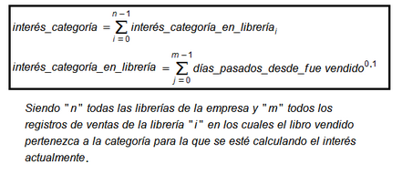

# PROYECTO FINAL DE ADMINISTRACIÓN Y DISEÑO DE BASES DE DATOS
## Proyecto de implementación de una base de datos para el supuesto de Librería Epopeya.

### Integrantes   

> Sergio Delgado López (alu0100893601@ull.edu.es)

> Eduardo Pérez Hernández (alu0100991659@ull.edu.es)

> Sergio Moreno Martín (alu0100710298@ull.edu.es)

## 1. Resumen ejecutivo.

Lorem ipsum

## 2. Definición de requisitos del sistema de base de datos.

> Enlace al documento: [Documento de requisitos](https://github.com/alu0100893601-Sergio/ADBBDD19_20/blob/master/PROYECTO-FINAL/Documentos-finales/Requisitos%20de%20Librer%C3%ADa%20Epopeya.pdf) 

La empresa Epopeya se dedica a la venta de libros de toda índole, desde los manuscritos más clásicos hasta lo último en vanguardia. Es una empresa con una gran trayectoria dentro del sector, y en los últimos tiempos se ha decidido informatizarse, para así poder dar un mejor servicio a sus clientes, así como para llevar una gestión más eficientes de sus librerías y recursos.  

Siendo como es una gran empresa con un gran número de librerías en su flota es importante, en primer lugar, tener almacenadas las diferentes librerías de las que dispone la empresa debiendo quedar almacenadas el código identificativo de la librería así como su nombre, localización y teléfono.  

El capital humano es de suma importancia para esta empresa por lo que también se desea almacenar los empleados de los que dispone cada una de las librerías de la empresa debiendo recoger su DNI, nombre completo, datos de contacto y su cargo dentro de la librería.  

Del mismo modo, se desea almacenar la información relevante del contrato de cada trabajador, en el que se especifica un código identificativo del contrato, DNI y nombre completo del trabajador, su sueldo, el tipo de contrato pudiendo ser éste temporal o indefinido, debiendo indicarse la fecha de inicio del mismo y la de finalización en caso de que sea temporal.  
 
Por supuesto, el eje central de toda empresa de éste sector son los libros, y por lo tanto se debe almacenar, minuciosamente, toda la información correspondiente a los mismos, de cara a ofrecer el mejor servicio posible. Para ello será necesario recoger el código identificativo de cada libro, su código ISBN, su nombre completo, su edición, la categoría a la que pertenece (al menos una), su fecha de lanzamiento, su precio y su autor. También se desea saber el stock que hay de cada libro en cada librería.  

La empresa también desea llevar un registro de los libros vendidos en cada librería, para ello se debe recoger, el código de la venta, el nombre del libro su ISBN, y la fecha en la que fue vendido.  

Dado que la empresa tiene en su haber un gran cantidad de libros en su catálogo, es importante dividir a los mismos en categorías siguiendo el clásico modelo de temáticas (terror, fantasía, etc). Por lo tanto se desea también almacenar las diferentes categorías en las que se agrupan los libros, para ello se especificará el nombre de cada categoría, así como la cantidad de libros pertenecientes a la misma. Hay que tener en cuenta que un libro puede pertenecer a más de un género. Se quiere también el interés que hay en cada categoría, que se deberá calcular mediante las siguientes fórmulas matemáticas.  

Se sabe que para el público interesado en los libros es importante conocer las últimas novedades que han sido publicadas. Estos libros estarán en primera línea del escaparate de las tienda y la página web, y por tanto se deberá recoger el día en que se puso en novedades y la cantidad de tiempo que debe permanecer en la misma.  

Por último, la empresa quiere implementar un sistema de puntos para clientes VIP, donde distinguirlos de los clientes normales, en el cual premiar a aquellos clientes con una alta fidelización en la empresa. Para distinguir a los clientes normales de los VIP se va a usar una tarjeta de socio con la que poder realizar compras tanto online como en las tiendas, dichas tarjetas serán distintas para los usuarios estándar y los VIP. De manera genérica se desea almacenar de ambos tipos sus datos personales (DNI, Nombre completo, correo electrónico y fecha de nacimiento). Los usuarios VIP tendran una tarjeta VIP con su identificador, la fecha de caducidad y la cantidad de puntos acumulados), debe tenerse en cuenta que el cliente puede canjear y aumentar su puntos en cualquier librería perteneciente a la empresa.. Los clientes normales en cambio tendrán una tarjeta normal con un identificador y una fecha de caducidad igual a la VIP, pero en este caso no tendrán puntos, simplemente les servirá para identificarse como clientes.  

Partiendo de todas estas especificaciones se pide obtener un diagrama ER para la BBDD de Epopeya y posteriormente realizar una implementación, teniendo en cuenta todas las restricciones comentadas, y asegurando la coherencia de la información a gestionar.  

## 3. Realización de modelos.

### 3.1. Modelo Entidad-Relación.

Por definición, un modelo de entidad-relación es una herramienta para el modelo de datos, la cual permite representar entidades de una Base de Datos [[1](https://es.wikipedia.org/wiki/Modelo_entidad-relaci%C3%B3n)], siguiendo los siguientes pasos:  

* Se elabora el diagrama (o diagramas) entidad-relación.
* Se completa el modelo con listas de atributos y una descripción de otras restricciones que no se pueden reflejar en el diagrama.  

El nivel de complejidad de un diagrama ER puede variar mucho, por ello se ha decidido elaborar dos iteraciones de diagrama, donde en la primera se hará un primera aproximación a modo de toma de contacto, y luego se hará uno más complejo que será la versión final de éste.

### 3.1.1. Primera aproximación.

 

### 3.1.2. ER extendido (diseño de la BD).

> Enlace al documento: [Documento de ERE]()  

IDENTIFICAIÓN Y DEFINICIÓN DE ENTIDADES  

1. Librerías: Representa a cada una de las librerías de la cadena Epopeya.  

| Atributo      | Tipo        |
| :-----------: |:-----------:|
| Identificador | Varchar(10) |
| Localización  | Varchar(50) |
| Nombre        | Varchar(30) |
| Teléfono      | Varchar(12) |

2. Libros: Es la entidad que representa a cada uno de los libros de los que se dispone.  

|       Atributo       |      Tipo     |
|:--------------------:|:-------------:|
|         ISBN         |  Varchar(12)  |
|        Título        |  Varchar(50)  |
|        Precio        |     Float     |
|        Género        |  Varchar(20)  |
| Fecha de lanzamiento |      Date     |
|         Autor        | Varchar(100)  |
|         Stock        |      Int      |
|        Edición       |      Int      |

3. Clientes registrados: Representa a los clientes registrados a las librerías.  

|          Atributo          |     Tipo     |
|:--------------------------:|:------------:|
|             DNI            |  Varchar(9)  |
|       Nombre comlpeto      | Varchar(100) |
|           *Nombre          |  Varchar(30) |
|         *Apellidos         |  Varchar(30) |
|            Email           |  Varchar(30) |
|     Fecha de nacimiento    |     Date     |
|    Identificador tarjeta   |  Varchar(10) |
| Fecha de caducidad tarjeta |     Date     |

4. Clientes registrados/VIP: Distinción para los usuario de tipo VIP.  

|          Atributo          |     Tipo     |
|:--------------------------:|:------------:|
|             Puntos         |  Int         |

5. Clientes registrados/Normal: Distinción para los usuarios de tipo Normal.  

6. Empleados: Entidad para registrar a todos los empleados de la empresa.  

|          Atributo          |     Tipo     |
|:--------------------------:|:------------:|
|             DNI            |  Varchar(9)  |
|          Teléfono          |  Varchar(12) |
|            Cargo           |  Varchar(30) |
|       Nombre completo      | Varchar(100) |
|           *Nombre          |  Varchar(30) |
|         *Apellidos         |  Varchar(30) |

7. Contratos: Es la entidad asociada a los empleados para registrar sus contratos.  

|          Atributo          |     Tipo     |
|:--------------------------:|:------------:|
|        Identificador       |  Varchar(10) |
|            *DNI            |  Varchar(9)  |
|         *ContratoID        |  Varchar(10) |
|           Sueldo           |     Float    |
|       Nombre completo      | Varchar(100) |
|           *Nombre          |  Varchar(30) |
|         *Apellidos         |  Varchar(30) |
|       Fecha de inicio      |     Date     |

8. Contratos/Indefinido: Para los contratos indefinidos.  

9. Contratos/Temporal: Para los contratos temporales.  

|          Atributo          |     Tipo     |
|:--------------------------:|:------------:|
|  Fecha de finalización     |  Date        |

10. Registro de ventas: Para conocer los datos de una venta de libros en las librerías.  

|     Atributo    |     Tipo    |
|:---------------:|:-----------:|
| Código de venta | Varchar(10) |
|  Fecha de venta |     Date    |
|       ISBN      | Varchar(12) |
|      Título     | Varchar(50) |

11. Géneros: Sirve para distinguir los géneros en los que se puede encapsular un libro.  

|   Atributo   |     Tipo    |
|:------------:|:-----------:|
|    Nombre    | Varchar(20) |
| Nº de libros |     Int     |
|    Interés   | Varchar(10) |

### 3.2. Modelo Relacional.

### 3.3. Modelo UML.

## 4. Códigos SQL generados.

### 4.1. Mediante E/R.

### 4.2. Mediante diagrama UML (transformación a Objeto-Relacional).

## 5. Creación de tablas dentro de PostgreSQL.

## 6. Carga de datos.

## 7. Triggers.

## 8. Referencias.

* [Documento de requisitos en DRIVE](https://drive.google.com/open?id=1j2uHcNPnuSnuFk_eSTUGj-u-4FdOw5j0)