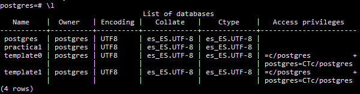
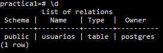
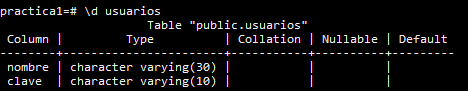
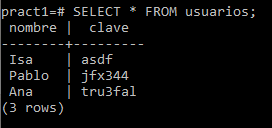

# Prac2
## Histórico de comnados para crear una tabla en Postgres.
1. `$ssh usuario@10.6.128.44`
2. `$sudo su` para actuar como **root**.
3. `$apt-get install postgresql`
4. `$su postgres` para actuar como el superusuario de Postgres.
5. `$psql`
6. `#CREATE USER usuario_prueba PASSWORD 'contrasenia';`
7. `#CREATE DATABASE practica1;`
8. `#\l` para listar las BBDD.  
    
9. `#CREATE TABLE usuarios (`  
    &emsp;`nombre varchar(30),`  
    &emsp;`clave varchar(10)`  
    `);`
10. `#\dt` para ver la tabla creada.  
    
11. `#\d` usuarios.  
    
12. `#INSERT INTO usuarios (nombre,clave) VALUES ('Casillas','Portero');`
13. `#INSERT INTO usuarios (nombre,clave) VALUES ('Ramos','Lateral');`
14. `#INSERT INTO usuarios (nombre,clave) VALUES ('Pique','Central');`
15. `#SELECT * FROM usuarios;` para ver todo el contenido de la tabla.  
    

> Sergio Delgado López (alu0100893601@ull.edu.es)

> Eduardo Pérez Hernández (alu0100991659@ull.edu.es)

> Sergio Moreno Martín (alu0100710298@ull.edu.es)