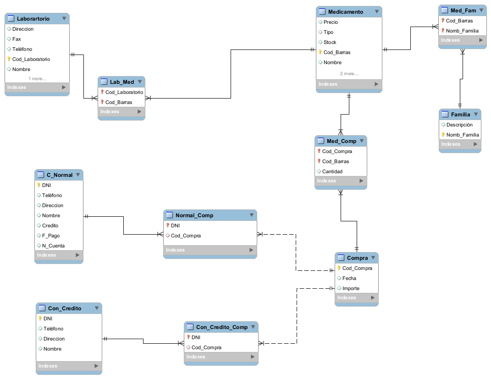
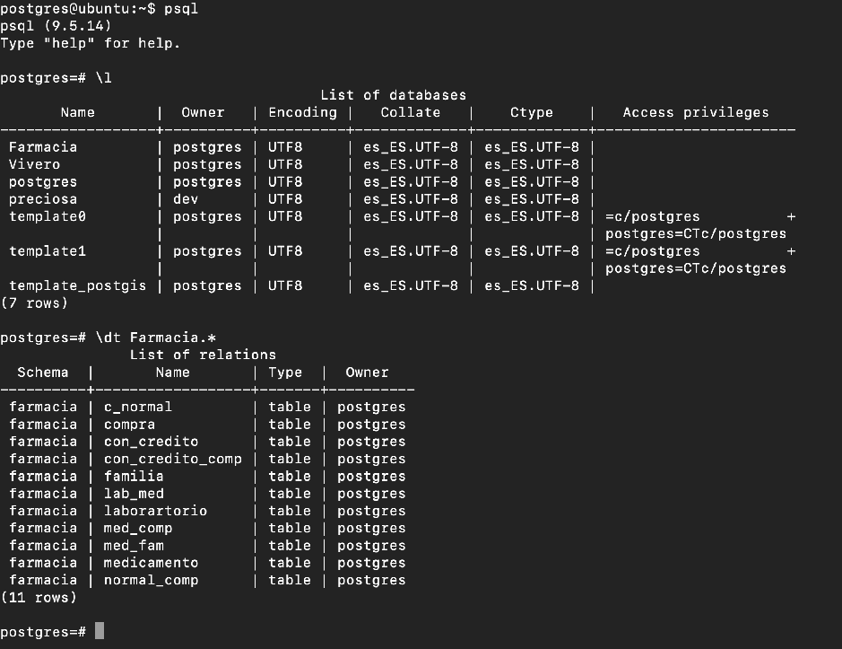
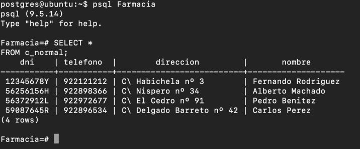
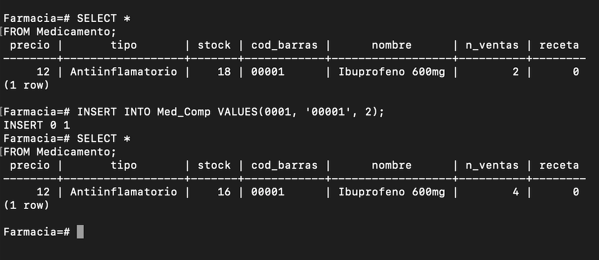

# Prac7
## Modelo relacional de BBDD con uso de workbench y triggers.

### Modelo de empresa de Farmacia  
Workbench -> [Archivo](https://github.com/alu0100893601-Sergio/ADBBDD19_20/tree/master/Prac7/Farmacia.mwb)  
Script -> [Archivo](https://github.com/alu0100893601-Sergio/ADBBDD19_20/tree/master/Prac7/Farmacia.sql)  
Trigger -> [Archivo](https://github.com/alu0100893601-Sergio/ADBBDD19_20/tree/master/Prac7/Trigers.sql)  

### Desarrollo
Diseño realizado en MySQL Workbench:    
  

Tabla dentro de PostgreSQL:    
  

Algunas entradas de ejemplo:    
   

Funcionamiento del trigger:    
  

> Sergio Delgado López (alu0100893601@ull.edu.es)

> Eduardo Pérez Hernández (alu0100991659@ull.edu.es)

> Sergio Moreno Martín (alu0100710298@ull.edu.es)
