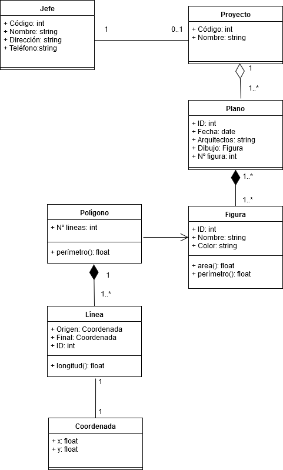

# Prac8
## Modelo objeto-relacional de BBDD sobre supuesto de gestión de proyectos.

### Modelo de Proyectos 
UML -> [Archivo](https://github.com/alu0100893601-Sergio/ADBBDD19_20/tree/master/Prac8/Proyectos_UML.png)  
Script -> [Archivo](https://github.com/alu0100893601-Sergio/ADBBDD19_20/tree/master/Prac8/script_proyectos.sql)  

### Desarrollo
Diseño realizado en MySQL Workbench:    
  

Scripts:    
```SQL
CREATE TABLE jefe
(
    Codigo INTEGER,
    Nombre TEXT,
    Direccion TEXT,
    Telefono TEXT
);

CREATE TABLE proyecto
(
    Codigo INTEGER,
    Nombre TEXT
);

CREATE TABLE Plano
(
    N_Id INTEGER,
    Fecha_entrega DATE,
    Arquitectos TEXT,
    N_figura INTEGER,
    Dibujo Figura
);

CREATE TABLE Figura
(
    Id INTEGER,
    Nombre TEXT ,
    Color TEXT
    ,
);

CREATE TABLE Poligonos
(
    N_Lineas INTEGER
)
INHERITS
(Figura);

CREATE TYPE Coordenada AS
(
 x_cor INTEGER,
 y_cor INTEGER
);

CREATE TABLE Linea
(
    Id INTEGER,
    Origen Coordenada,
    Destino Coordenada
);
```

> Sergio Delgado López (alu0100893601@ull.edu.es)

> Eduardo Pérez Hernández (alu0100991659@ull.edu.es)

> Sergio Moreno Martín (alu0100710298@ull.edu.es)
